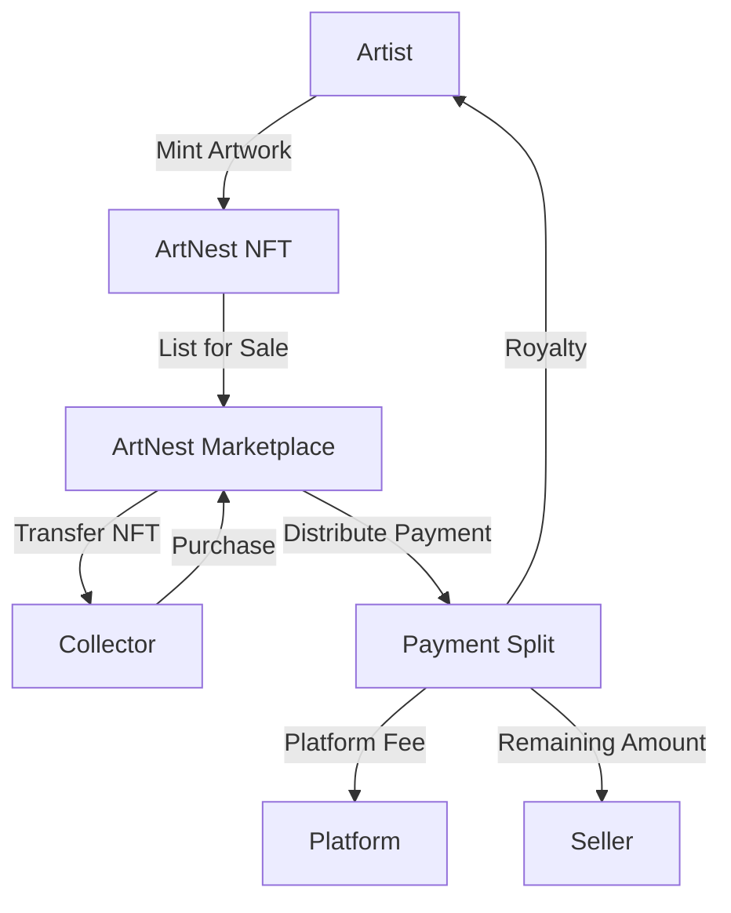

# ArtNest Discovery Platform

A decentralized platform built on the Stacks blockchain that enables independent artists to showcase and sell their artwork as NFTs. ArtNest creates direct connections between artists and art enthusiasts while ensuring fair compensation through automated royalty distribution.

## Overview

ArtNest consists of two main smart contracts that work together to create a complete NFT marketplace specifically designed for digital artwork:

- **ArtNest NFT**: Handles the creation and management of artwork NFTs, including artist verification and artwork provenance
- **ArtNest Marketplace**: Manages listings, sales, and automated distribution of payments including royalties

### Key Features

- Artist verification system
- Automated royalty payments for secondary sales
- Comprehensive artwork provenance tracking
- Category-based artwork discovery
- Featured collections
- Flexible pricing and listing management

## Architecture



## Contract Documentation

### ArtNest NFT Contract

The foundational contract for creating and managing artwork NFTs.

#### Core Functions

- `mint-artwork`: Creates a new artwork NFT with metadata
- `verify-artist`: Adds an artist to the verified list (admin only)
- `transfer`: Transfers artwork ownership
- `update-artwork-metadata`: Allows artists to update artwork details
- `update-royalty-percentage`: Modifies royalty percentage for future sales

### ArtNest Marketplace Contract

Manages the marketplace functionality including listings, sales, and payment distribution.

#### Core Functions

- `create-listing`: Lists an artwork for sale
- `purchase`: Handles artwork purchase and payment distribution
- `cancel-listing`: Removes an artwork from sale
- `update-listing-price`: Modifies listing price
- `add-to-featured-collection`: Adds artwork to featured collections

## Getting Started

### Prerequisites

- Clarinet
- Stacks wallet
- STX tokens for transactions

### Installation

1. Clone the repository
2. Install dependencies with Clarinet
3. Deploy contracts to the Stacks blockchain

### Basic Usage

```clarity
;; Mint a new artwork
(contract-call? .artnest-nft mint-artwork 
    "My Artwork" 
    "Description" 
    block-height 
    "Digital" 
    u10 
    "ipfs://...")

;; List artwork for sale
(contract-call? .artnest-marketplace create-listing 
    .artnest-nft 
    u1 
    u100000000 
    u10 
    none 
    "digital-art")
```

## Function Reference

### ArtNest NFT

```clarity
(mint-artwork (title (string-utf8 100)) 
             (description (string-utf8 500))
             (creation-date uint)
             (medium (string-utf8 50))
             (royalty-percentage uint)
             (uri (string-utf8 256)))

(transfer (artwork-id uint) (recipient principal))
```

### ArtNest Marketplace

```clarity
(create-listing (nft-contract principal)
               (token-id uint)
               (price uint)
               (royalty-percent uint)
               (expires-at (optional uint))
               (category (optional (string-ascii 20))))

(purchase (listing-id uint))
```

## Development

### Testing

Run tests using Clarinet:

```bash
clarinet test
```

### Local Development

1. Start Clarinet console:
```bash
clarinet console
```

2. Deploy contracts:
```clarity
(contract-call? .artnest-nft ...)
```

## Security Considerations

### Limitations

- Maximum royalty percentage of 20%
- Platform fee fixed at 5%
- Listing expiration dates are optional

### Best Practices

1. Always verify token ownership before transactions
2. Check listing expiration before purchases
3. Validate royalty percentages are within allowed range
4. Ensure proper error handling for all transactions